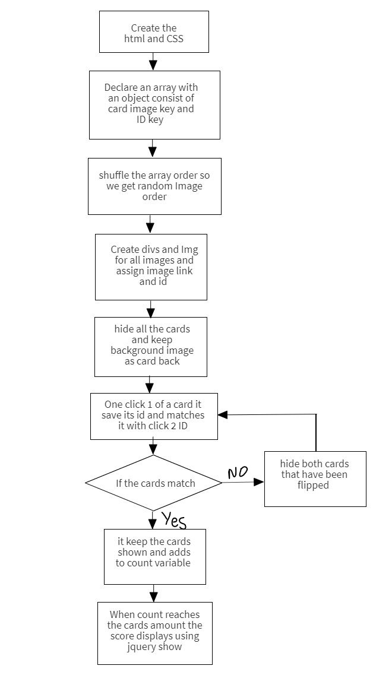

# Project Title

Marvel Concentration Game

## Description

In this game your objective is to match 2 identical cards. All cards will be revealed when you find all the matches. This game depends on your ability to remember where you saw that card.

## Game link - play it here

https://ali-hd.github.io/Project-1-Concentration_game/

### Technical Used

HTML
CSS
JavaScript, and jQuery for DOM manipulation

### Wireframes

### User Stories

As a user I want to see how much time have passed playing.
As a user I want to see the amount of flips of two cards.
As a user I want to keep matched cards open.
As a user I want to hide the 2 cards if they are not a match.
As a user I want to get a higher score if I was able to solve it faster.
As a user I want the timer to stop and to see the score when I matched all the cards.

## Planning and Development Process

I used a create element function that creates divs for each card. each div will be created for an img element and source to be used. These will come from an object that contains a key for Image and its ID. Each div will have the ID of its corresponding image. When i click the images I will be able to know by the second click if both images match or not, by using their ID. I used Jquery to hide and show elements if they are a match or not. The timer will be displayed above and it will be incrementing. When the game stop I divide the time when the game is done by a large number to get the score so that if the time is less the score will be more. 

### Problem-Solving Strategy

I used the console.log() throughout the code, whenever I needed to check the outcome of a variable at a particular time. Also when I find a problem in my code I read the code line by line slowly to see if something doesn't make sense.

### Unsolved problems

One unsolved problem is that when you open two cards and quickly open a third one the picture will not hide. This problem will be fixed in future iterations.

### Favorite functions

My favorite function has to be the Create Elements function. When I use an object that contains all my images and ID names, it will create a div with an id and an image inside it corresponding to that ID. Also its simple to add/remove more cards in the future or replace them  

## Acknowledgments

* I would like to thank Misk foundation & General Assembly for giving me the opportunity to take this course.  
* And a special thanks to our instructors Yassir, Ebere, Ahmad and Atheer for helping us along the way.

 ## References

https://developer.mozilla.org/en-US/
https://www.w3schools.com/